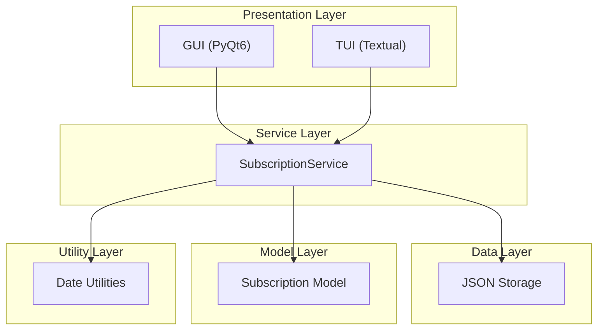
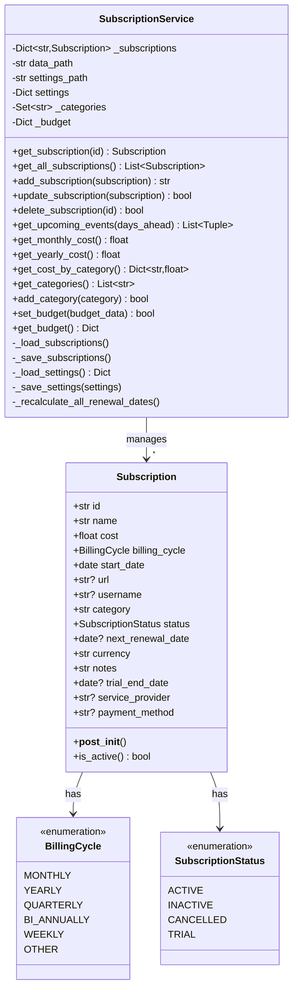
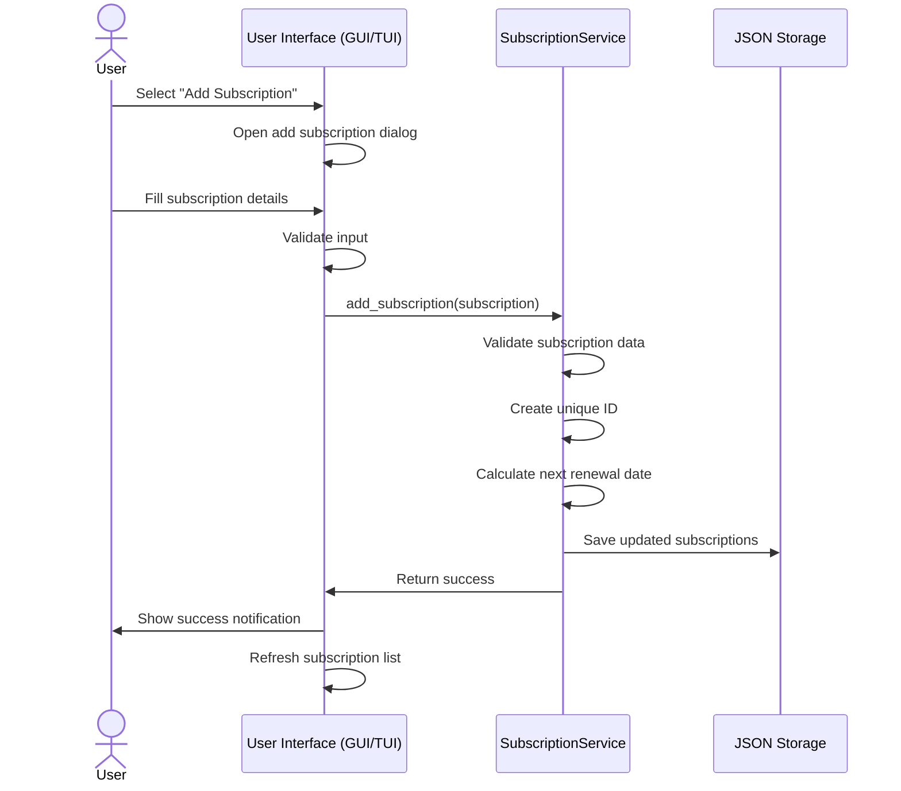
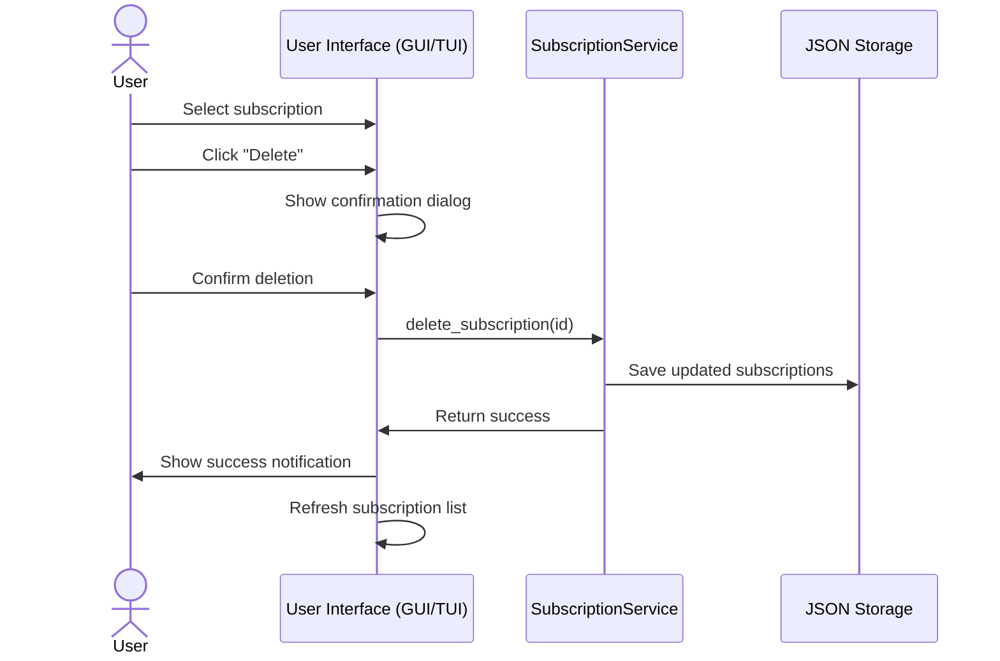
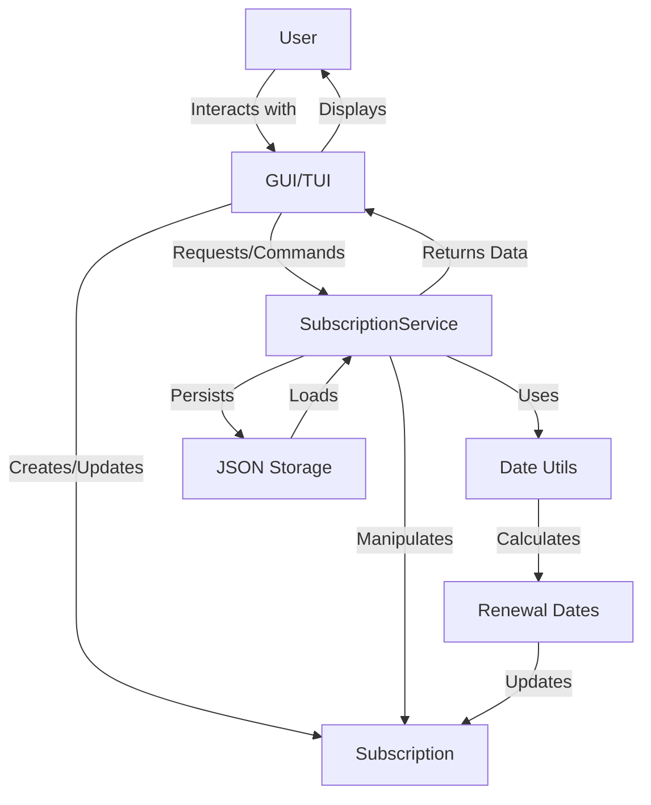
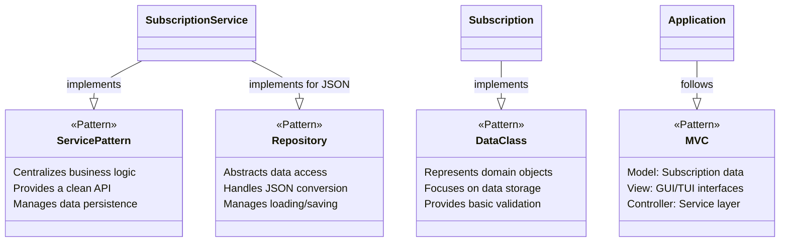

# Project Architecture: SubTracker

## 1. Introduction

This document outlines the architectural design for SubTracker, a software application designed to help users manage their recurring subscriptions. The goal is to create a user-friendly tool accessible through both a traditional graphical user interface (GUI) and a text-based user interface (TUI) for users who prefer working in a command-line environment.

## 2. Core Goals

* **Subscription Management:** Allow users to easily add, view, edit, and delete their subscriptions.
* **Dual Interfaces:** Provide both a visually rich GUI and an efficient TUI.
* **Data Persistence:** Securely store subscription data locally in JSON format.
* **Clear Overview:** Offer clear views of upcoming renewals through calendar displays in both interfaces.
* **Financial Insights:** Track spending by category and provide budget alerts.

## 3. High-Level Architecture

The application follows a layered architecture pattern with clear separation of concerns:



### 3.1 Directory Structure

The application is organized into distinct layers to separate concerns and promote maintainability:

* **`/src` (Source Code):** Contains the core logic and interface code.
  * `models/`: Defines the structure of the data (e.g., `Subscription` class).
  * `services/`: Handles business logic, data storage operations (primarily `SubscriptionService`).
  * `utils/`: Holds common helper functions (e.g., date calculations).
  * `gui/`:
    * `streamlit_app.py`: Contains the code for the graphical user interface built with Streamlit.
  * `tui/`: Contains the code for the text-based user interface built with Textual.
    * `components/`: Custom widgets for the TUI.
    * `screens/`: Screen layouts for the TUI application.
    * `dialogs/`: Dialog screens for adding, editing, and confirming actions.
  * `data/`: Contains data models and sample data files.
* **`/tests` (Tests):** Contains automated tests to ensure the application works correctly.
* **`/docs` (Documentation):** Holds project documentation.
* **`/config` (Configuration):** Stores configuration settings (e.g., database file location).
* **`/scripts` (Scripts):** Contains utility scripts and validation logs.

## 4. Data Model

### 4.1 Key Classes



### 4.2 Data Management

Subscription data is stored locally in a JSON file (`subscriptions.json` by default, configurable via `config/settings.json`). This format is human-readable and easy to manage for a moderate number of subscriptions. Application settings (like the path to the data file) are stored in a separate configuration file (`config/settings.json`).

Key features of the data management system:
- Custom JSON encoder/decoder for handling complex types like enums and dates
- Support for categories with associated budgets
- Automatic calculation of renewal dates based on billing cycles

## 5. User Interfaces

### 5.1 Interface Architecture

```mermaid
graph TB
    subgraph "Entry Point"
        Main["main.py<br>(Entry Point)"]
    end

    subgraph "GUI (Streamlit)"
        StreamlitApp["streamlit_app.py<br>(Streamlit Script)"]
        # Add specific Streamlit widgets used later
    end

    subgraph "TUI Components"
        TUIApp["app.py<br>(Textual.App)"]
        TUIScreen["MainScreen<br>(Screen)"]
        TUIDialogs["Dialogs<br>(AddEdit, Confirm)"]
        TUIWidgets["Custom Widgets<br>(Calendar, Summary)"]
    end

    subgraph "Shared Service"
        SS["SubscriptionService"]
    end

    Main -->|User runs Streamlit| StreamlitApp
    Main -->|User selects TUI| TUIApp

    StreamlitApp --> SS

    TUIApp --> TUIScreen
    TUIScreen --> TUIDialogs
    TUIScreen --> TUIWidgets
    TUIScreen --> SS
```

### 5.2 GUI (Graphical User Interface)
- Built using Streamlit, a framework for rapidly building interactive web applications with Python.
- The GUI is contained within `src/gui/streamlit_app.py`.
- Features (to be implemented):
  - Dataframe view of all subscriptions (`st.dataframe`).
  - Form-based add/edit functionality (`st.form`, `st.sidebar`).
  - Financial summary display (`st.metric`, `st.write`).
  - Upcoming renewals display (`st.write`, potentially `st.expander`).
  - Interaction managed via Streamlit's execution model and `st.session_state`.

### 5.3 TUI (Text-based User Interface)
- Built using Textual, a modern TUI framework
- Implements a screen-based architecture for different views
- Features:
  - List-based subscription management
  - Form dialogs for adding/editing subscriptions
  - Custom calendar view for upcoming renewals
  - Financial summary display
  - Keyboard shortcuts for common actions

## 6. Component Details

### 6.1 Core Components

1. **Subscription Model (`src/models/subscription.py`):**
   - Defines the `Subscription` dataclass with fields like name, cost, billing cycle, etc.
   - Includes enums for `BillingCycle` (Monthly, Yearly, etc.) and `SubscriptionStatus` (Active, Inactive, Cancelled, Trial)
   - Implements validation logic in `__post_init__`

2. **Subscription Service (`src/services/subscription_service.py`):**
   - Central service for managing subscription data
   - Handles CRUD operations (Create, Read, Update, Delete)
   - Manages data persistence to JSON file
   - Provides features like:
     - Category management
     - Budget tracking and alerts
     - Cost calculations by category and period
     - Upcoming event notifications
     - Spending forecasts

3. **Date Utilities (`src/utils/date_utils.py`):**
   - Handles date calculations for subscription renewals
   - Uses `python-dateutil` for handling complex date arithmetic

### 6.2 GUI Components (Streamlit)

1.  **Streamlit Application (`src/gui/streamlit_app.py`):**
    *   Defines the entire GUI layout and logic.
    *   Uses Streamlit functions (`st.title`, `st.dataframe`, `st.button`, `st.form`, `st.sidebar`, `st.session_state`, etc.) to build the interface.
    *   Instantiates and interacts with the `SubscriptionService` to fetch and modify data.

### 6.3 TUI Components

1. **TUI Application (`src/tui/app.py`):**
   - Sets up Textual application
   - Configures screens and bindings
   - Initializes the subscription service

2. **Main Screen (`src/tui/screens/MainScreen.py`):**
   - Provides list-based subscription management
   - Features buttons and keyboard shortcuts for actions
   - Includes custom calendar view and financial summary

3. **Custom Widgets (`src/tui/components/`):**
   - `FinancialSummary` for displaying spending metrics
   - `CustomCalendarView` for visualizing upcoming renewal dates

4. **Dialogs (`src/tui/dialogs/`):**
   - `AddEditDialog` for creating and modifying subscriptions
   - `ConfirmDialog` for verifying destructive actions

## 7. Interaction Sequences

### 7.1 Adding a Subscription



### 7.2 Deleting a Subscription



## 8. Project Structure

```
project-root/
├── src/
│   ├── gui/
│   │   ├── __init__.py
│   │   ├── app.py
│   │   ├── components/
│   │   └── screens/
│   │       ├── __init__.py
│   │       └── MainScreen.py
│   ├── tui/
│   │   ├── __init__.py
│   │   ├── app.py
│   │   ├── app.tcss
│   │   ├── components/
│   │   │   ├── CustomCalendarView.py
│   │   │   └── FinancialSummary.py
│   │   ├── dialogs/
│   │   │   ├── AddEditDialog.py
│   │   │   └── ConfirmDialog.py
│   │   └── screens/
│   │       └── MainScreen.py
│   ├── services/
│   │   ├── __init__.py
│   │   └── subscription_service.py
│   ├── models/
│   │   ├── __init__.py
│   │   └── subscription.py
│   ├── utils/
│   │   ├── __init__.py
│   │   └── date_utils.py
│   └── data/
├── tests/
│   ├── services/
│   │   └── test_subscription_service.py
│   └── utils/
│       └── test_date_utils.py
├── docs/
│   ├── ARCHITECTURE.md
│   ├── CONVENTIONS.md
│   ├── TOOLS.md
│   ├── CHANGELOG.md
│   └── REFERENCES.md
├── config/
│   └── settings.json
├── scripts/
│   └── validation_logs/
├── requirements.txt
└── main.py
```

## 9. Data Flow



## 10. Execution Flow

1. **Application Start:**
   - `main.py` serves as the entry point
   - User selects either GUI or TUI interface
   - Selected interface is initialized with a SubscriptionService instance

2. **Data Flow:**
   - User interfaces interact with the SubscriptionService
   - Service performs CRUD operations, updating an in-memory dictionary of Subscription objects
   - Service handles loading data from and saving data to the JSON file
   - Utility functions (`date_utils`) are used by the service layer for calculations

## 11. Design Patterns Used


